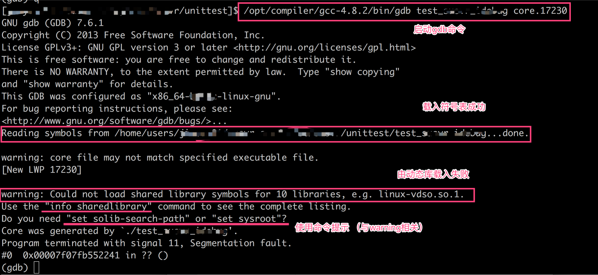
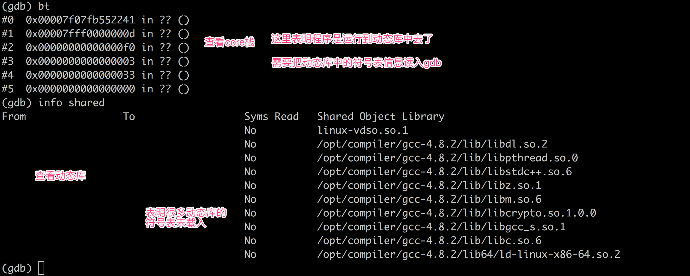
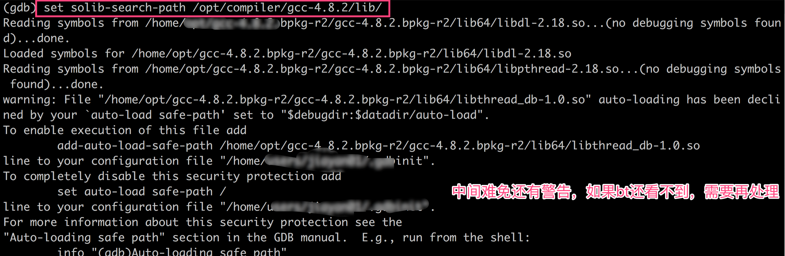
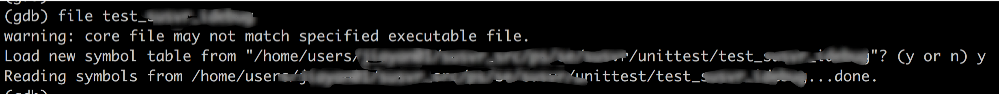

基本命令: ```gdb bin core```


##### 示例




##### 查看core栈

bt看core栈，经常遇到??，结合开始时的警告信息，表明程序运行到动态库中去了

查看动态库情况，确实很多动态库的符号表未载入



##### 载入动态库符号表 (set solib-search-path + 库的路径)

结果会看到很多done之类的信息，说明加载成功，



此时再看 `info shared` 会不一样了

我们的例子此时已经可以看到core栈了


其他命令

##### 重新载入符号表 (确定符号表被成功载入)

``` file bin```




##### 查看多线程core栈

`info threads` 查看由哪些线程

`thread id` 指定要看的线程