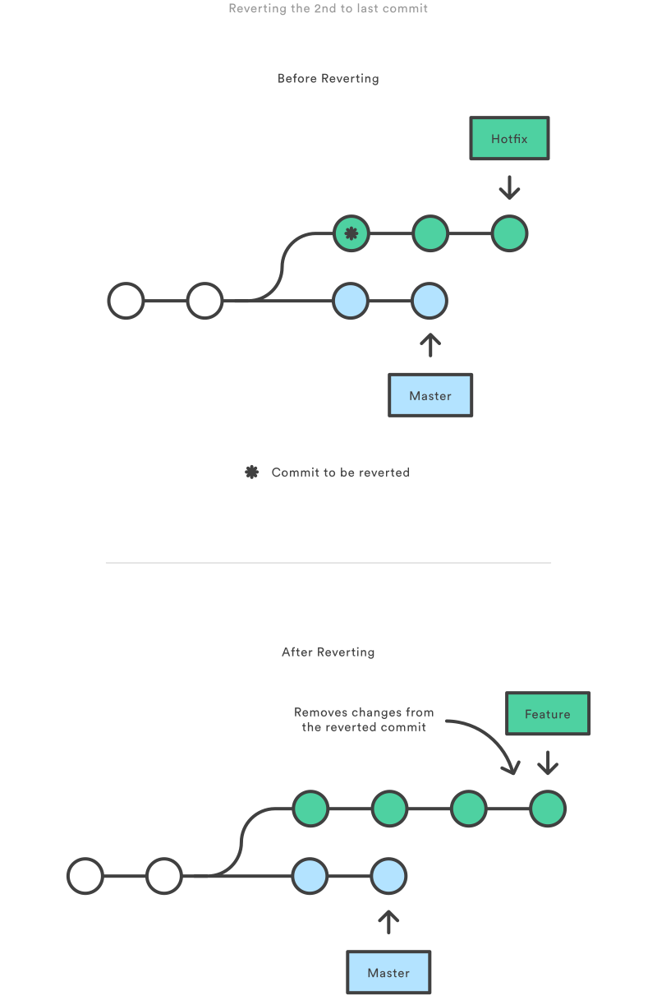
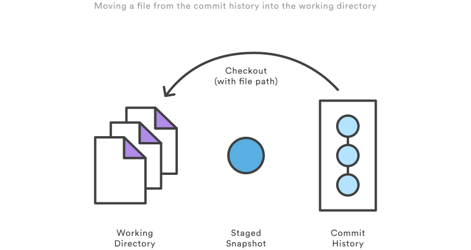

##### 列出远程分支

```sh
git branch -r
```

##### 列出远程和本地分支

```sh
git branch -a
```

##### 分支增删改

```sh
# 增
git branch branch_name [start_point]
# 删
git branch -d|-D branch_name
# 改
git branch -m|-M branch_name new_name
```

##### git-rebase

git rebase用于把一个分支的修改合并到当前分支


##### 分支移动到某次提交

```sh

```


##### 删除某次指定提交

```sh
# 撤销最近的一次提交
git revert HEAD

# 撤销
git revert commit_id
```


### 撤销操作 - Commit-level Operation

`git reset, git checkout, git revert`


首先，明白在git仓库中的任何操作(编辑操作, git 命令操作)对以上各个组件的影响

`git reset` 和 `git checkout` 可操作的单位：commit-level，file-level (由传给命令的参数决定)

`git revert` 只有 commit-level


#### reset

reset是一种简单的撤销提交方式，在你还没有与他人共享之前 (共享之后呢?)

针对commit-level, reset是一种将分支移动指定commit_id的一种方式，可以被用于移除当前分支上的部分提交，例子:

```sh
git checkout hotfix
git reset HEAD~2
```

hotfix分支回退了两个提交，相应的这两个提交之后会被删除 (git垃圾回收机制)


reset不仅可用于移动当前分支，还可以改变 `staged snapshot` 和 `working directory `

-   `--soft` – The staged snapshot and working directory are not altered in any way.
-   `--mixed` – The staged snapshot is updated to match the specified commit, but the working directory is not affected. This is the default option.
-   `--hard` – The staged snapshot and the working directory are both updated to match the specified commit.


These flags are often used with `HEAD` as the parameter. For instance, `git reset --mixed HEAD` has the affect of unstaging all changes, but leaves them in the working directory. On the other hand, if you want to completely throw away all your uncommitted changes, you would use `git reset --hard HEAD`. These are two of the most common uses of `git reset`.

Be careful when passing a commit other than `HEAD` to `git reset`, since this re-writes the current branch’s history. As discussed in [The Golden Rule of Rebasing](https://www.atlassian.com/git/tutorials/resetting-checking-out-and-reverting/commit-level-operations), this a big problem when working on a public branch.


##### reset TODO: file-level


#### Checkout

commit-level 切换分支; 影响的是HEAD的指向

```sh
git checkout hotfix # 图例
git checkout HEAD~2 # 图例
git checkout commit_id
```

将HEAD移动到指定的分支，同时更新 working directory.

当切换时的 working directory 不干净时, 需要先自行清理干净: stash (藏起来) or commit (提交)


```sh
git checkout HEAD~2
```


##### detached HEAD state

当没有分支指向HEAD时，处于detached HEAD state

如果在该状态下进行修改提交，切换分支后(移走HEAD后), 这些修改提交全部丢失

For this reason, you should always create a new branch before adding commits to a detached `HEAD`.


#### revert

通过创建新提交来撤销一次提交，这是一种相对安全的方式，它未对已有历史做修改（如果历史里不小心有密码，它是不合适的~~~）

```sh
git checkout hotfix
git revert HEAD~2
```





Contrast this with `git reset`, which *does* alter the existing commit history. For this reason, `git revert` should be used to undo changes on a public branch, and `git reset` should be reserved for undoing changes on a private branch.


You can also think of `git revert` as a tool for undoing *committed*changes, while `git reset HEAD` is for undoing *uncommitted* changes.


Like `git checkout`, `git revert` has the potential to overwrite files in the working directory, so it will ask you to commit or stash changes that would be lost during the revert operation.


### 撤销操作 - File-level Operation

 `git reset` 和 `git checkout` 可以接收若干文件为可选参数，作为被操作对象.


#### reset

`git reset` 将某次commit_id中指定的文件恢复到 staged snapshot，同时将该文件的修改(若有)保留在 working directory

常用的 `git reset HEAD files` 将文件 unstaged, 而修改依然保留在 working directory (将HEAD中的文件恢复到staged snapshot, 自然该文件在staged snapshot中为干净的)

 `--soft`, `--mixed`, and `--hard` flags 对File-level的`git reset`操作无影响

--soft`, `--mixed`, and ` —hard flags do not have any effect on the file-level version of `git reset`, as the staged snapshot is *always*updated, and the working directory is *never* updated. （working direcotry is never updated不对吧）


```sh
git reset HEAD~2 foo.py
```


#### checkout

checkout类似于reset, 不同的是它将指定commit_id的指定文件恢复到*working directory*





Just like the commit-level invocation of `git checkout`, this can be used to inspect old versions of a project—but the scope is limited to the specified file.

If you stage and commit the checked-out file, this has the effect of “reverting” to the old version of that file. Note that this removes *all* of the subsequent changes to the file, whereas the `git revert`command undoes only the changes introduced by the specified commit.

Like `git reset`, this is commonly used with `HEAD` as the commit reference. For instance, `git checkout HEAD foo.py` has the effect of discarding unstaged changes to `foo.py`. This is similar behavior to `git reset HEAD --hard`, but it operates only on the specified file.


### 撤销操作-总结

You should now have all the tools you could ever need to undo changes in a Git repository. The `git reset`, `git checkout`, and `git revert` commands can be confusing, but when you think about their effects on the working directory, staged snapshot, and commit history, it should be easier to discern which command fits the development task at hand.

The table below sums up the most common use cases for all of these commands. Be sure to keep this reference handy, as you’ll undoubtedly need to use at least some them during your Git career.

| Command        | Scope        | Common use cases                         |
| -------------- | ------------ | ---------------------------------------- |
| `git reset`    | Commit-level | Discard commits in a private branch or throw away uncommited changes |
| `git reset`    | File-level   | Unstage a file                           |
| `git checkout` | Commit-level | Switch between branches or inspect old snapshots |
| `git checkout` | File-level   | Discard changes in the working directory |
| `git revert`   | Commit-level | Undo commits in a public branch          |
| `git revert`   | File-level   | (N/A)                                    |


##### 修改最后一次提交

```sh
git commit --amend

# example
# 下面的三条命令最终只是产生一个提交，第二个提交命令修正了第一个的提交内容(也可以有其他修改)
# 如果没有针对文件内容的修改，相当于可以修改一次提交信息
$ git commit -m 'initial commit'
$ git add forgotten_file
$ git commit --amend

```


### 合并操作


#### 合并冲突

##### 逻辑冲突

git自动处理（合并/应用补丁）成功，但是逻辑上是有问题的

比如：

1. 另外一个人修改了文件名，但我还使用老的文件名，这种情况下自动处理是能成功的，但实际上是有问题的。
2. 函数返回值含义变化，但我还使用老的含义，这种情况自动处理成功，但可能隐藏着重大BUG

主要通过自动化测试来保障！这种冲突不属于 不是真正解决git报告的冲突

如果没有自动化测试保障，就需要自行观察合并结果了


##### 内容冲突

两个用户修改了同一个文件的同一块区域，git会报告内容冲突。我们常见的都是这种，后面的解决办法也主要针对这种冲突。


TODO

```sh
git cherry-pick
```


#### ref

https://www.atlassian.com/git/tutorials/resetting-checking-out-and-reverting