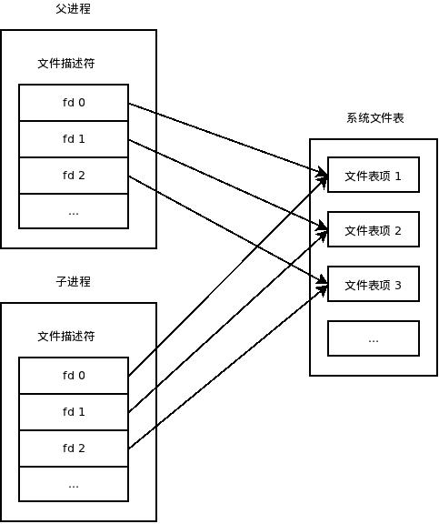

#### close-on-exec机制


每个文件描述符都有一个`close-on-exec`标志.

默认情况下, 这个标志最后一位被设置为 0。这个标志符的具体作用在于当开辟其他进程调用`exec()`族函数时，在调用`exec`函数之前为exec族函数释放对应的文件描述符。


fork函数: 子进程以*写时复制 (COW，Copy-On-Write) 方式*获得父进程的数据空间、堆和栈副本, 也包括文件描述符 (刚刚fork成功时, 父子进程中相同的文件描述符指向系统文件表中的同一项)




会调用exec执行另一个程序，此时会用全新的程序替换子进程的正文，数据，堆和栈等。此时保存文件描述符的变量当然也不存在了，我们就无法关闭无用的文件描述符了。所以通常我们会fork子进程后在子进程中直接执行close关掉无用的文件描述符，然后再执行exec。


fork子进程前打开某个文件句柄时就指定好：“这个句柄我在fork子进程后执行exec时就关闭”。其实时有这样的方法的：即所谓的 close-on-exec。


close-on-exec的实现只需要调用系统的fcntl就能实现，很简单几句代码就能实现：

```c
int fd = open("foo.txt", O_RDONLY);  
int flags = fcntl(fd, F_GETFD);  
flags |= FD_CLOEXEC;  
fcntl(fd, F_SETFD, flags);
// 当fork子进程后，仍然可以使用fd。但执行exec后系统就会字段关闭子进程中的fd了

// 方法二
// open函数，其中flags参数可以传入O_CLOEXEC标记 [注意：linux 2.6.23才开始支持此标记]
int fd = open("foo.txt", O_RDONLY | O_CLOEXEC); 
```


对于套接字描述符：

```c
// 创建socket的时候加上 SOCK_CLOEXEC标志，就能够达到我们要求的效果
// 在fork子进程中执行exec的时候，会清理掉父进程创建的socket
SOCKET ss = ::socket(PF_INET, SOCK_STREAM | SOCK_CLOEXEC, 0);
```


例子 来自 http://blog.csdn.net/sunlylorn/article/details/6363727

```c++
// parent
#include<sys/types.h>
#include<sys/wait.h>
#include <fcntl.h>
#include <stdio.h>
#include <unistd.h>
#include <string.h>

//file:fcntl
int main()
{
	pid_t pid;
    int fd = open("test.txt", O_RDWR|O_APPEND);
	if (fd == -1) {
        printf("open err\n");
    }
	printf("fd = %d\n",fd);
	printf("fork!\n");
	fcntl(fd, F_SETFD, 0);
	char *s = "print by parent";
	pid = fork();
    if (pid < 0) {
        printf("have some error in fork()");
    } else if (pid == 0) {
        printf("I am child process\n");
        execl("ass", "./ass", &fd, NULL);
    }

    printf("I am parent process\n");
    // 等着给子进程收尸体
	wait(NULL);
	if (write(fd, s, strlen(s)) == -1) {
        printf("parent write error\n");
    }
	close(fd);
	return 0;
}


// child
#include <fcntl.h>
#include <stdio.h>
#include <string.h>
#include <unistd.h>

//ass 源代码
int main(int argc, char *argv[])
{
	int fd = *argv[1];
	printf("argc = %d fd = %d\n", argc, fd);
	char *s = "print by child";
    if (write(fd, (void *)s, strlen(s)) == -1) {
        printf("child write error\n");
    }
	printf("come from child\n");
	close(fd);
	return 0;
}

```


ref

http://blog.csdn.net/chrisniu1984/article/details/7050663