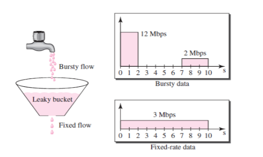
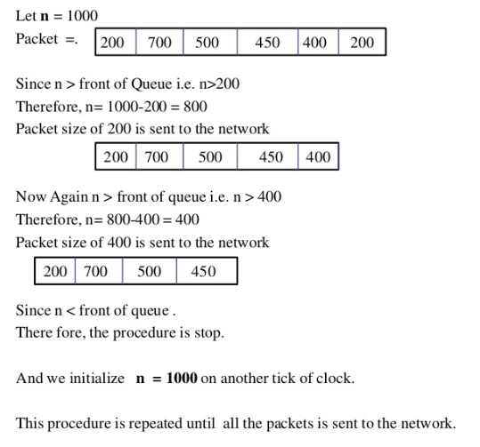

### 限流算法

在开发高并发系统时，有三把利器用来保护系统：缓存、降级和限流


##### 1. 限流(Rate Limiting/Throttling)最重要的

-   流速稳定 "stable rate"
-   最大速率在安全范围内


###### 1.1 流量整形(Traffic Shaping)

This is a mechanism to control the amount and the rate of the traffic sent to the network. 


##### 2. Leaky Bucket Algorithm 漏桶算法

以不确定速率到来的数据包不断进入水桶，桶底"洞"按照固定速率把包漏走，如果流入过快，桶满后以不同策略处理(如拒绝)；桶满可以做为流量异常的判断点




抽象层次略高的算法，只简单描述了一个模型，具体实施都有待实现者选择


进一步阐述，当桶满后，如何处理?

1.  暂时拦住新流入的水，待桶中一部分水漏走，再放行 ([Traffic Shaping](http://en.wikipedia.org/wiki/Traffic_shaping)，核心是 等待)
2.  直接抛弃 ([Traffic Policing](http://en.wikipedia.org/wiki/Traffic_policing)，核心是 丢弃)


###### 2.1 涉及两个变量

1.  桶的大小Burst，流量突发时能存下的水
2.  洞口流出速度Rate，即流量下发的固定速度


###### 2.1 As a Meter 做为计量 (The Leaky Bucket Algorithm as a Meter)

>   A counter associated with each user transmitting on a connection is incremented whenever the user sends a packet and is decremented periodically. If the counter exceeds a threshold upon being incremented, the network discards the packet. The user specifies the rate at which the counter is decremented (this determines the average bandwidth) and the value of the threshold (a measure of burstiness)


**关键点**

1.  The bucket (analogous to the counter) is in this case used as a meter to test the conformance of packets, rather than as a queue to directly control them
2.  注意与Token Bucket相区分？
3.  注意burst == rate时， burst > rate时，burst < rate时


**解释**

与 Token Bucket Algorithm比较，一种算法的两种描述?

>   As can be seen, these two descriptions are essentially mirror images of one another: ...


**实现**

1.  固定容量burst的Bucket，有一个固定流出的速率rate
2.  若桶空，则停止流出
3.  当数据包到来，它会向桶中增加指定量的水 (定长 or 变长)
4.  如果增加水后导致桶满，则数据包不符合，否则桶内水量增加，数据包被允许通过


```c
// (1)
double rate;               // leak rate in calls/s
double burst;              // bucket size in calls

long refreshTime;          // time for last water refresh
double water;              // water count at refreshTime

refreshWater() {
    long  now = getTimeOfDay();
    // 水随着时间流逝, 不断流走, 最多就流干到0
    water = max(0, water- (now - refreshTime)*rate); 
    refreshTime = now;
}

/**
 * @brief nWater大小的数据包希望获得通过
 */
bool permissionGranted(int nWater) {
    // (1) 水以固定速率流出
    refreshWater();
    // (4) 判断能否通过
    if (water + nWater < burst) {
        // (3)
        water += nWater;
        return true;
    } else {
        return false;
    }
}
```


###### 2.2 As a Queue 做为调度队列 (The Leaky Bucket Algorithm as a Queue)

>   The leaky bucket consists of a finite queue. When a packet arrives, if there is room on the queue it is appended to the queue; otherwise it is discarded. At every clock tick one packet is transmitted (unless the queue is empty).


**关键点**

1.  主要用于流量整形功能 ([Traffic Shaping](http://en.wikipedia.org/wiki/Traffic_shaping)，核心是 等待)
2.  强制固定的速率(队列非空时) ，每时刻固定取走一定数量的数据包
3.  导致队列空的两种原因: 1) 流入慢；2) 高并发的断断续续流入，每次突发流量，多数被抛弃，队列中会有gap
4.  应对变长的数据包时，计量单位改为数据包的组成单位 "byte-counting"
5.  只有速率一个参数
6.  无法充分利用网络资源


**解释**

1.  无法充分利用网络资源 （没完全搞懂）

>   The implementation of the leaky-bucket as a queue does not use available network resources efficiently. Because it transmits packets only at fixed intervals, there will be many instances when the traffic volume is very low and large portions of network resources (bandwidth in particular) are not being used. Therefore no mechanism exists in the leaky-bucket implementation as a queue to allow individual flows to burst up to port speed, effectively consuming network resources at times when there would not be resource contention in the network. Implementations of the token bucket and leaky bucket as a meter do, however, allow output traffic flows to have bursty characteristics.


**实现**

1.  对固定尺寸的数据包，每个时刻从Queue摘走Rate个数据包
2.  变长尺寸的数据包，此时Rate需要基于数据包的最小单位，而不是(1)中的数据包


**以变长数据包为例，算法描述及用例**

1.  每个时刻初始化一个计数器Rate
2.  对Queue中的数据包，根据数据包的尺寸，摘走若干个数据包 (总尺寸 < Rate)




##### 3. Token Bucket Algorithm 令牌桶算法

系统以恒定的速度往桶里放令牌，仅当请求能从桶里取到指定数量的令牌时，才被允许处理


**令牌桶算法**

1.  每秒会有 r 个令牌放入桶中，或者说，每过 1/r 秒桶中增加一个令牌
    -   实现上，1秒一次性放入r个，or, 精确的每1/r秒放入1个
    -   加入令牌的动作，以计时的方式，延迟到请求来取令牌即可
2.  桶中最多存放 b 个令牌，如果桶满了，新放入的令牌会被丢弃
    1.  桶的容量b和每秒可存入的r，两者之间的关系?
3.  当一个 n 字节的数据包到达时，消耗 n 个令牌，然后发送该数据包
4.  如果桶中可用令牌小于 n，则该数据包将被缓存或丢弃


令牌桶算法(Token Bucket)和 Leaky Bucket 效果一样，但方向相反的算法


##### 4. 计数器

PS: 2.3中的方案，数据包尺寸都退化到1，水流出速度/令牌添加速度 以请求结束1个处理1个，跟计数器比较?


##### 5. Guava RateLimiter 解决"过去的使用不足"


### 参考

http://en.wikipedia.org/wiki/Leaky_bucket

https://github.com/springside/springside4/wiki/Rate-Limiter

http://www.geeksforgeeks.org/leaky-bucket-algorithm/


### **下面是待整理的资料，来自网络，书本等，如有冒犯，请联系我**


目前有几种常见的限流方式：

1.  通过限制单位时间段内调用量来限流
2.  通过限制系统的并发调用程度来限流
3.  使用漏桶（Leaky Bucket）算法来进行限流
4.  使用令牌桶（Token Bucket）算法来进行限流


##### 1. 通过限制单位时间段内调用量来限流

通过一个计数器统计单位时间段某个服务的访问量，如果超过了我们设定的阈值，则该单位时间段内则不允许继续访问、或者把接下来的请求放入队列中等待到下一个单位时间段继续访问。这里，计数器在需要在进入下一个单位时间段时先清零

-   若"单位时间段"太长，会导致限流的效果变得不够“敏感”。比如我们把单位时间设置成1小时，如果在第29分钟，该服务的访问量就达到了我们设定的阈值，那么在接下来的31分钟，该服务都将变得不可用
-   若“单位时间段”太短，阈值越难设置，同时过短的单位时间段也对限流代码片段提出了更高要求
-   清零方案


##### 2. 通过限制系统的并发调用程度来限流


http://manzhizhen.iteye.com/blog/2311691


最简单的QPS限流方式，维护一个"最后被允许请求的时间戳"，确保下一个通过的请求时间差 >= 1/QPS

```
Time last_time;
RateLimit Qps;

function acquire() {
    if ((now - last_time) >= 1/Qps) {
        return true;
    } else {
        // sleep and try acquire() again
        return false;
    }
}
```

缺点，对过去记忆很差，只能记住最后一次，而忘记了之前，如果新授权的请求q1之后，很久之后才有新请求q2，那么这个RateLimiter会立即只记住q2，而忘记了q1与q2之间这段时间，引起利用不足 “过去一段时间的利用不足”


(不会有边界问题?)


(1) “过去的利用不足 past underutilization” 意味着有多余的可用资源 (sure?)，RateLimiter应该加把劲将它们利用起来，例如网络传输，意外着多余的网卡缓冲区可用

(2) “past underutilization” 也可能意味着服务器对新请求是准备不足的 (less ready for future request)，比如很久不服务的cache是陈旧的，容易被新到来的请求触发重新刷新全量的缓存


在Guava RateLimiter中使用 变量 "storedPermits" 记录 "past underutilization"，范围是 [0, maxStroedPermits], 即没有利用不足或者到最大的利用不足

新请求可以被允许

1.  "storedPermits" 记录的
2.  XXX?


解释如下:


缺没有很好的处理单位时间的边界，比如在前一秒的最后一毫秒里和下一秒的第一毫秒都触发了最大的请求数，将目光移动一下，就看到在两毫秒内发生了两倍的QPS


缓存的目的是提升系统访问速度和增大系统能处理的容量，可谓是抗高并发流量的银弹

降级是当服务出问题或者影响到核心流程的性能则需要暂时屏蔽掉，待高峰或者问题解决后再打开

有些场景并不能用缓存和降级来解决

限流的目的是通过对并发访问/请求进行限速或者一个时间窗口内的的请求进行限速来保护系统


一般开发高并发系统常见的限流有

限制总并发数（比如[数据库](http://lib.csdn.net/base/mysql)连接池、线程池）

限制瞬时并发数（如nginx的limit_conn模块，用来限制瞬时并发连接数）

限制时间窗口内的平均速率（如Guava的RateLimiter、nginx的limit_req模块，限制每秒的平均速率）


##### 计数器法

最简单也是最容易实现，

**限制qps:**

对于A接口来说，我们1分钟的访问次数不能超过100个。那么我们可以这么做：在一开 始的时候，我们可以设置一个计数器counter，每当一个请求过来的时候，counter就加1，如果counter的值大于100并且该请求与第一个 请求的间隔时间还在1分钟之内，那么说明请求数过多；如果该请求与第一个请求的间隔时间大于1分钟，且counter的值还在限流范围内，那么就重置 counter。


算法虽然简单，但是有一个十分致命的问题，那就是临界问题

他在0:59时，瞬间发送了100个请求，并且1:00又瞬间发送了100个请求，那么其实这个用户在 1秒里面，瞬间发送了200个请求。我们刚才规定的是1分钟最多100个请求，也就是每秒钟最多1.7个请求，用户通过在时间窗口的重置节点处突发请求， 可以瞬间超过我们的速率限制


**限制并发:**

没有上述重置过程，请求结束counter减1


#### 滑动窗口算法

一个时间窗口就是一分钟。然后我们将时间窗口进行划分，比如图中，我们就将滑动窗口 划成了6格，所以每格代表的是10秒钟。每过10秒钟，我们的时间窗口就会往右滑动一格。每一个格子都有自己独立的计数器counter，比如当一个请求 在0:35秒的时候到达，那么0:30~0:39对应的counter就会加1


那么滑动窗口怎么解决刚才的临界问题的呢？我们可以看上图，0:59到达的100个请求会落在灰色的格子中，而1:00到达的请求会落在橘黄色的格 子中。当时间到达1:00时，我们的窗口会往右移动一格，那么此时时间窗口内的总请求数量一共是200个，超过了限定的100个，所以此时能够检测出来触 发了限流。


我再来回顾一下刚才的计数器算法，我们可以发现，计数器算法其实就是滑动窗口算法。只是它没有对时间窗口做进一步地划分，所以只有1格。

由此可见，当滑动窗口的格子划分的越多，那么滑动窗口的滚动就越平滑，限流的统计就会越精确。


看起来是这样一种实现https://github.com/jcppython/php-ratelimiter


https://github.com/titan-web/rate-limit

https://github.com/google/guava/blob/v18.0/guava/src/com/google/common/util/concurrent/RateLimiter.java

https://github.com/google/guava/blob/v18.0/guava/src/com/google/common/util/concurrent/SmoothRateLimiter.java#L280:L307

