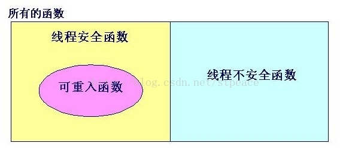

## 1. 线程安全 (thread-safe)

函数被多个并发进程(线程)反复调用时，能保证正确结果，否则称为**线程不安全的(thread-unsafe)**

**Thread safety** is a [computer programming](http://en.wikipedia.org/wiki/Computer_programming) concept applicable in the context of [multi-threaded](http://en.wikipedia.org/wiki/Thread_(computer_science)) programs. A piece of code is thread-safe if it only manipulates shared data structures in a manner that guarantees safe execution by multiple threads at the same time.


## 2. 线程不安全函数

导致线程不安全的因素，例如:

-   用到『共享变量』
-   用到全局变量等
-   函数返回静态变量指针
-   调用到线程不安全函数

###### 处理方法

函数内用到的共享变量加锁保护，但是会降低函数效率 


### 3. 可重入函数(reentrance)

可重入函数：可重入函数是线程安全函数的一种，其特点在于它们被多个线程调用时，不会引用任何共享数据。

可重入函数通常要比不可重入的线程安全函数效率高一些，因为它们不需要同步操作


In [computing](http://en.wikipedia.org/wiki/Computing), a [computer program](http://en.wikipedia.org/wiki/Computer_program) or [subroutine](http://en.wikipedia.org/wiki/Subroutine) is called reentrant if it can be interrupted in the middle of its execution and then safely called again ("re-entered") before its previous invocations complete execution. The interruption could be caused by an internal action such as a jump or call, or by an external action such as a[hardware interrupt](http://en.wikipedia.org/wiki/Hardware_interrupt) or [signal](http://en.wikipedia.org/wiki/Signal_(computing)). Once the reentered invocation completes, the previous invocations will resume correct execution.


可重入与muti-thread与否无关，包括单线程多次重入，只关注结果

为了保证函数是可重入的，需要做到一下几点：

1.  首先满足线程安全
2.  **可重入与线程安全的区别?**


### 4. 线程安全的不可重入函数

   1. strtok不可重入，线程不安全

   2. 加锁的strtok不可重入，但线程安全

   3. strtok_r可重入，线程安全


线程安全确不可重入的例子

```c++
typedef void (*MyCallback)() ;
NonRecursiveMutex mutex ;

void myFunction(MyCallback f)
{
   lock(mutex) ;
   f() ;
   unlock(mutex) ;
}

int main(int argc, char * argv[])
{
   // 会造成死锁
   myFunction(myFunction) ;
   return 0 ;
}
```


思考: 一个线程会有线程安全的问题吗？分别面对线程不安全函数、线程安全不可重入函数、可重入函数时?


参考:

https://stackoverflow.com/questions/2799023/what-exactly-is-a-reentrant-function


