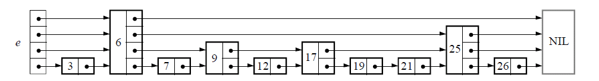

# 跳跃表(Skip List)

### 1. 了解历史

William Pugh发明，Communications of the ACM June 1990, 33(6) 668-676，Skip lists: a probabilistic alternative to balanced trees


### 2. 定义

Skip lists are a data structure that can be used in place of balanced trees. Skip lists use probabilistic balancing rather than strictly enforced balancing and as a result the algorithms for insertion and deletion in skip lists are much simpler and significantly faster than equivalent algorithms for balanced trees.


### 3. 总体特点

跳跃列表是对**有序的链表**附加前进链接，增加是以随机化的方式进行的，所以在链表中的查找可以快速的跳过部分(因此得名)


-   基于有序的链表
-   一种随机化的数据结构
-   空间换时间
-   二分思想，先大跨步，再小碎步 (二叉树也是这样的其实)
-   效率可比拟于二叉查找树 (对于大多数操作需要O(log n)平均时间)


### 4. 结构特征

一个跳表，应该具有以下特征：

-   一个跳表应该有几个层（level）组成
-   跳表的第一层包含所有的元素
-   每一层都是一个有序的链表
-   如果元素x出现在第i层，则所有比i小的层都包含x
-   第i层的元素通过一个down指针指向下一层拥有相同值的元素


#### 4.1 构建有序链表


对于这样的简单链表，查找一个元素`i`需要遍历整个链表


#### 4.2 跳跃表思想

对有序链表，在节点中存储指向前面第二个节点的指针，查找一个节点，仅需遍历`N/2`个节点即可


这基本上就是跳表的核心思想，其实也是一种通过“**空间来换取时间**”的一个算法，通过在每个节点中增加了向前的指针，从而提升查找的效率。


### 5. 跳跃表示例

如果一个基点存在k个向前的指针的话，那么称该节点是k层的节点

一个跳表的层`max_level`为跳表中所有节点中最大的层数。





#### 5.1 初始化

初始化的过程很简单，仅仅是生成下图中红线区域内的部分，也就是跳表的基础结构


#### 5.2 查找/插入/删除

关键是查找，插入/删除都是查找后，重塑结构

```c
// 最高层 max_level
// 向前的指针 forward
// 结点结构
struct Node {
    int key;
    // 该结点所在层
    int level;
    // levels[i]为第i层forward指针
    Node** levels;
}
function search(int key) {
    Node* x = header;
    for (i_level = max_level; i_level > 0; i_level++) {
        while (x->levels[i_level]->key < key) {
            x = x->levels[i_level];
        }
    }  
}

```


以插入17为例


另一幅图


#### 附录 redis使用中有以下几点不同

1.  允许有重复的分值
2.  对元素的比对不仅要比对他们的分值，还要比对他们的对象
3.  每个跳跃表节点都带有一个后退指针


#### 5.3 随机在哪儿

插入元素的时候，元素所占有的层数完全是随机的，通过随机算法产生，常用的如：

```c
// 相当与做一次丢硬币的实验，如果遇到正面，继续丢，遇到反面，则停止，
// 用实验中丢硬币的次数 K 作为元素占有的层数。显然随机变量 K 满足参数为 p = 1/2 的几何分布，
// K 的期望值 E[K] = 1/p = 2. 就是说，各个元素的层数，期望值是 2 层。
int random_level()  
{  
    K = 1;  
    while (random(0,1))  
        K++;  
    return K;  
}  
```

随机算法很多，再比如redis所用

```c
int zslRandomLevel(void) {
      int level = 1;
      // 执行level += 1;的概率为ZSKIPLIST_P，也就是说k层节点的数量是k+1层节点的1/ZSKIPLIST_P倍
      // 把跳跃表看成平衡ZSKIPLIST_P叉树
      // ZSKIPLIST_P = 0.25
      while ((random()&0xFFFF) < (ZSKIPLIST_P * 0xFFFF))
          level += 1;

      return (level<ZSKIPLIST_MAXLEVEL) ? level : ZSKIPLIST_MAXLEVEL;
  }
```


### 6. 为什么选择跳跃表

#### 6.1 查找复杂度O(log n)

查找复杂度 O(log N)，TODO: 理论证明?


##### 6.1.1 复杂度理解

先定义一下，A node that has k forward pointers is called a level k node。假设k层节点的数量是k+1层节点的P倍，那么其实这个SkipList可以看成是一棵平衡的P叉树，从最顶层开始查找某个节点需要的时间是O(logpN)，which is O(logN) when p is a constant。


##### 6.1.2 理论证明

TODO


#### 6.2 类似结构比较

目前经常使用的平衡数据结构有：B树，红黑树，AVL树，Splay Tree, Treep等

-   跳跃表实现简单
-   跳跃表效率和红黑树以及 AVL 树不相上下，但跳表的原理相当简单，只要你能熟练操作链表，
-   可以看到(见paper)，数据量很大时，跳跃表的优势显著(当然skiplist很浪费内存这个劣势也很明显)。
-   主要优势: 更具可并发性
-   劣势: 浪费内存


http://stackoverflow.com/questions/256511/skip-list-vs-binary-tree 【值得继续阅读 TODO】


更多的是从可并发性方面考虑

Skip lists are more amenable to concurrent access/modification. Herb Sutter wrote an [article](http://www.ddj.com/hpc-high-performance-computing/208801371) about data structure in concurrent environments. It has more indepth information.

The most frequently used implementation of a binary search tree is a [red-black tree](http://en.wikipedia.org/wiki/Red-black_tree). The concurrent problems come in when the tree is modified it often needs to rebalance. The rebalance operation can affect large portions of the tree, which would require a mutex lock on many of the tree nodes. Inserting a node into a skip list is far more localized, only nodes directly linked to the affected node need to be locked.

红黑树经常需要rebalance，涉及大范围的修改，跳跃表更多时候是局部性的


### ref

http://dsqiu.iteye.com/blog/1705530

http://www.cnblogs.com/xuqiang/archive/2011/05/22/2053516.html


**®声明: 个人笔记，多数内容整理自网络，未规范标注出处，如有冒犯，请联系处理**

​             **内容有误，如有耽误，烦请见谅**